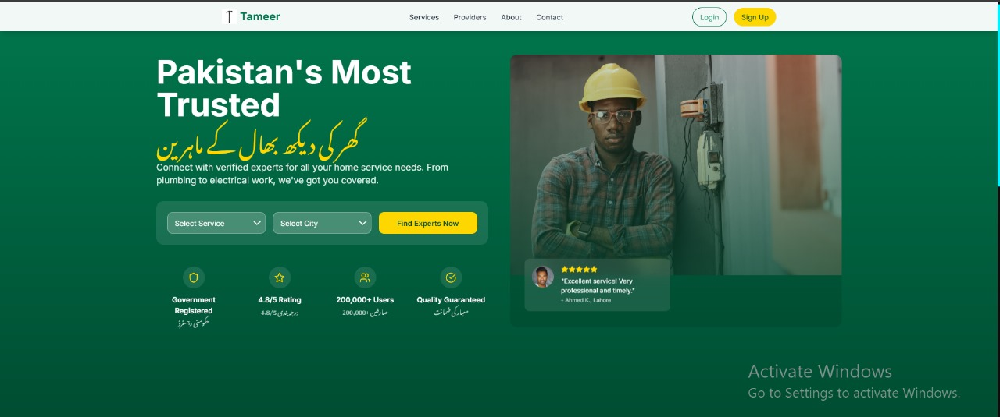

# Tameer
A sleek, Next.js-powered platform to connect users with top-rated service providers like plumbers, electricians, and tutors. Fast, responsive, and bilingual (English/Urdu) with a stunning UI. #NextJS #React #TailwindCSS
# 🏗️ TAMEER - Service Provider Platform

### 🚀 A Next.js-powered, **frontend-focused** platform to connect users with top service providers in Pakistan.

---

## 🌟 **Overview**
**Tameer** is a sleek, modern, and high-performance service provider platform built with **React, Next.js 14, and Tailwind CSS**. Designed with a **mobile-first** approach, it ensures a seamless user experience with smooth animations, interactive UI, and bilingual support (English/Urdu). 

🔹 **Find top-rated professionals** (plumbers, electricians, tutors, etc.) easily.  
🔹 **Search & Filter with an intuitive UI**.  
🔹 **Experience a visually stunning, high-speed interface**.  

---

## 🖼️ **Preview**


---

## 🎨 **Tech Stack**
| **Technology**       | **Usage** |
|---------------------|----------|
| **Next.js 14**       | App Router, Optimized Performance |
| **React.js**         | Component-based UI |
| **shadcn/ui**        | Modern UI Components |
| **Tailwind CSS**     | Custom Styling & Responsive Design |
| **Framer Motion**    | Stunning Animations |
| **Lucide React**     | Beautiful Icons |
| **Next.js Image**    | Optimized Asset Handling |
| **Inter & Noto Nastaliq Urdu** | Multi-language Typography |

---

## 🔑 **Key Features**
✅ **Blazing Fast & SEO-Optimized** (Built with Next.js 14)  
✅ **Fully Responsive** (Mobile-first design)  
✅ **Glassmorphism Effects & Custom Tailwind Theme**  
✅ **Smooth Animations & Transitions** (Framer Motion)  
✅ **Bilingual Support** (English 🇬🇧 | Urdu 🇵🇰)  
✅ **Dark Mode Ready** 🌙  

---

## 🏗️ **Core Components Built**
- 📌 **NavBar** → Responsive navigation with mobile menu  
- 📌 **Footer** → Bilingual footer with social links  
- 📌 **HeroSection** → Engaging landing section with search functionality  
- 📌 **FeaturedProviders** → Service provider cards with animations  
- 📌 **StatsSection** → Dynamic statistics display  
- 📌 **ProviderCard** → Reusable provider profile component  
- 📌 **SearchBar** → Multi-select search interface  

---

## 🔥 **Project Structure**
```
/tameer
 ├── /components    # Reusable UI Components
 ├── /pages         # Next.js Routing
 ├── /public        # Static Assets
 ├── /styles        # Tailwind Config & Global Styles
 ├── /utils         # Helper Functions
 ├── README.md      # Documentation
 ├── tameer.jpg     # Project Preview Image
```

---

## 🛠️ **Installation & Setup**
### Clone the Repo 🔽
```bash
git clone https://github.com/saadhtiwana/tameer.git
cd tameer
```

### Install Dependencies 📦
```bash
npm install
```

### Run the App 🚀
```bash
npm run dev
```
Your app will be live at **http://localhost:3000** 🎉

---

## 🌍 **Contribute & Support**
Want to make **Tameer** even better? Feel free to **fork, contribute, and submit PRs**! 🙌  
For issues and feature requests, open an **issue** [here](https://github.com/saadhtiwana/tameer/issues).

📧 **Contact:** saadhayat799@gmail.com  
📍 **GitHub:** [saadhtiwana](https://github.com/saadhtiwana)  

🔥 *Let's build the future of service provider platforms together!* 🚀
